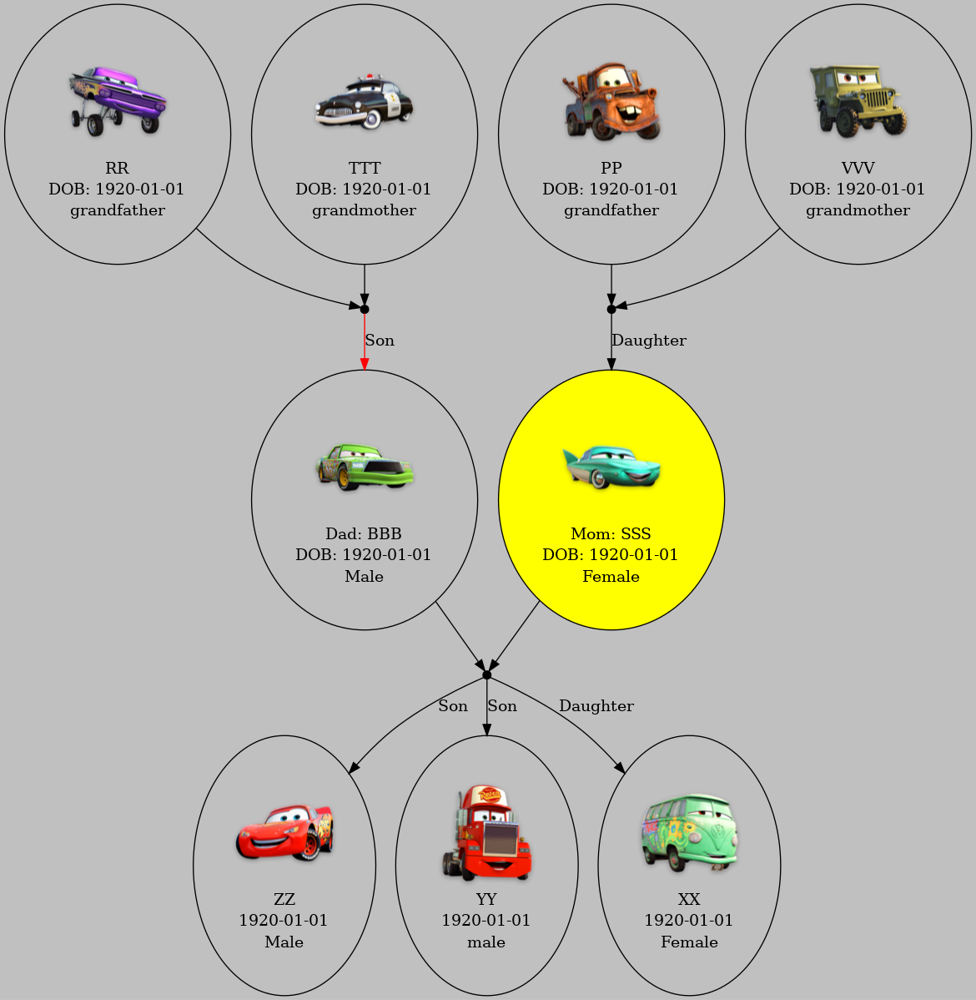

# FamilyTree

sudo apt-get install graphviz

sudo apt-get install python3-pygraphviz
 
 

# Remove Extra Background
convert input.png -trim output.png

# image into 128px
convert input.png -resize 128x128 -background white -gravity center -extent 128x128 output.png

 
# Add Padding After Trimming
 
convert input.png -trim -bordercolor transparent -border 10x10 output.png

 
 
 
 
# run

dot -Tpng family_tree.dot -o family_tree.png

# sample

# extra

https://github.com/boblyx/pyFamilyTree

